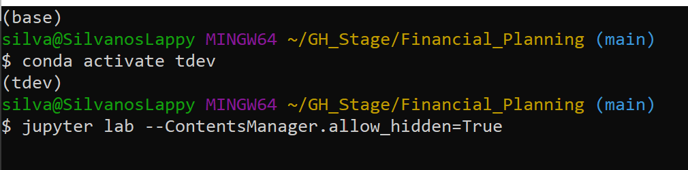
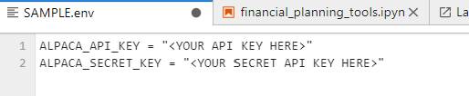
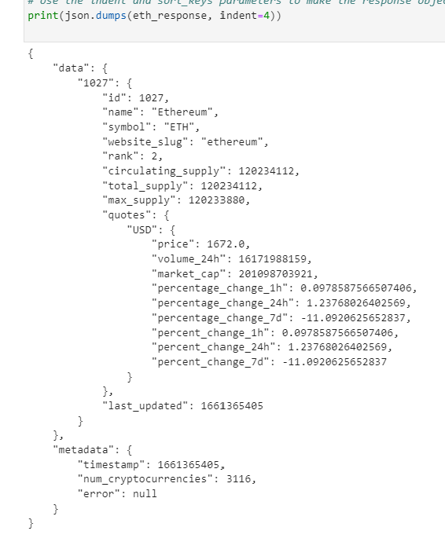
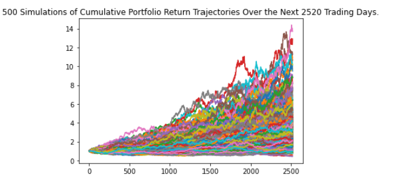
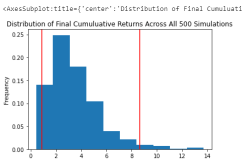

# Financial_Planning

This jupyter notebook does two things. Firstly, a portfolio consisting of stocks, bonds and cryptocurrency are evaluated to check for emergency fund adequacy
against the given monthly income of $12,000. Secondly, the stock/bond portion of the portfolio is analyzed to see if the owner is able to retire in 10 years. A 10 
and 30 year Monte Carlo Simulation are run with a 95% confidence interval to determine the range the portfolio is most likely going to be valued at for the given 
time periods. This ultimately gives a recommendation on whether or not the owner can retire in 10 years given a more aggressive investment strategy. 

---

## Technologies

Language: Python 3.9.12

Libraries used:

[Pandas](https://pandas.pydata.org/pandas-docs/stable/index.html) - For the creation and visualization of Data Frames

[Jupyter Labs](https://jupyter.org/) - An ipython kernel for interactive computing in python

[OS](https://docs.python.org/3/library/os.html) - Miscellaneous operating system interface

[Dotenv](https://github.com/motdotla/dotenv) - Module to load environment variables 

[Alpaca Trade API](https://alpaca.markets/docs/) - API for the Alpaca trading platform

**MC Forecast Tools** - A copy of this module is included in the downloadable files for this project

---

## Installation Guide

If you are using an anaconda or a conda environment chances are pandas, os and jupyter labs are already installed in your virtual environment 

If they are not then run:
```python
    pip install pandas
    pip install jupyterlab
    pip install os
```

dotenv and alpaca_trade_api need to be installed separately as they do not come in the anaconda environment.
You will need to run:
```python
    pip install dotenv
    pip install alpaca-trade-api
```

A copy of the **'MCForecastTools.py'** file is included in this repository.

---

## Usage

To run this jupyter lab notebook you will need to use GitBash and navigate to where you have exported the files associated with this project.

Next you will need to perform the following



This will open a jupyter lab notebook in your default browser with a special paramater to allow the .env file to be seen as it is usually a hidden file type. 

Important: You are going to need to create a **.env** file and populate it with your own personal Alpaca API Key and Secret Key.

Here is what it should look like:



To do this you create a new text file from the notebook launcher and rename it **.env** make sure to remove the **.txt** portion.

Next open **'financial_planning_tools.ipynb'** and click the double arrow to run the notebook. Alternatively you can run each cell individually.

This will run the entire notebook. Make sure to follow the pseudocode to see what has been coded and what is being displayed.

Note - This may take a while to run as the Monte Carlo Simulation typically has a faily long run time. Expect around 3-5 minutes of waiting before notebook is complete.

---

## Highlights:

Here are a few snippets of what you can find in this project

### JSON Data from API:



### 10 Year Simulation Plot:



### 10 Year Simulation Distribution:



---

## Contributors

Created by Silvano Ross while in the UW FinTech Bootcamp
> Contact Info:
> email: silvanoross3@gmail.com |
> [GitHub](https://github.com/silvanoross) |
> [LinkedIn](https://www.linkedin.com/in/silvano-ross-b6a15a93/)

---

## License

[MIT](LICENSE)

